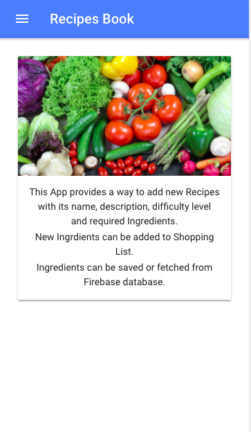
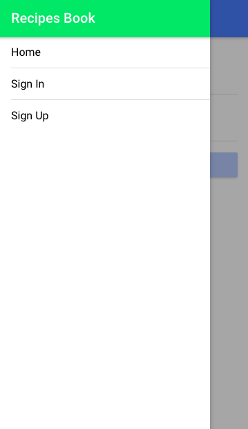
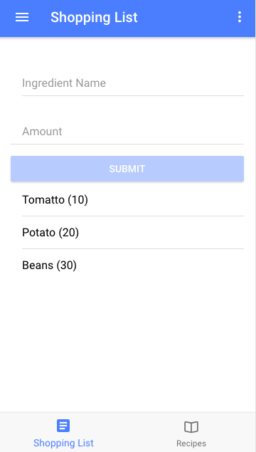
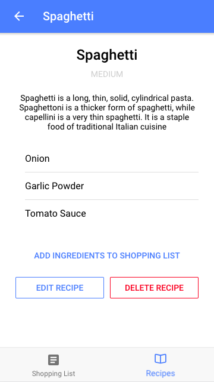
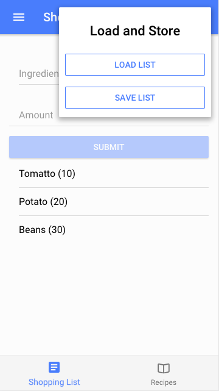

# Recipe Book

## This App is created by using Ionic 3 with Angular 5

## This App provides the following functionalities:

. This App provides a way to add new Recipes with its name, description, difficulty level and required Ingredients.
. New Ingredients can be added to Shopping List.
. Ingredients can be saved or fetched from Firebase database.

